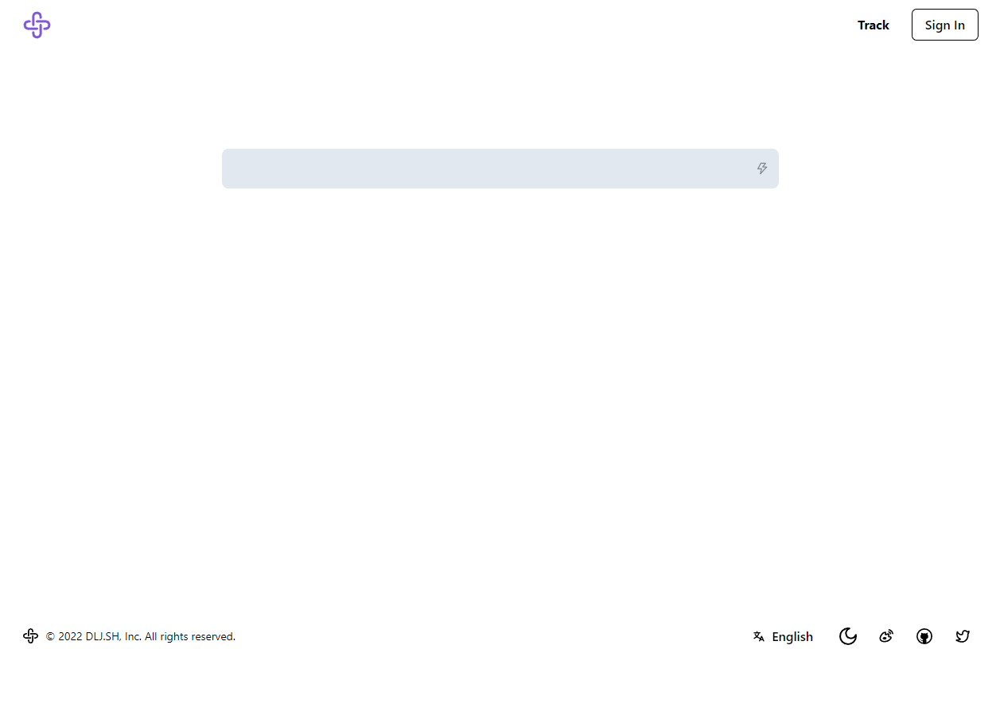
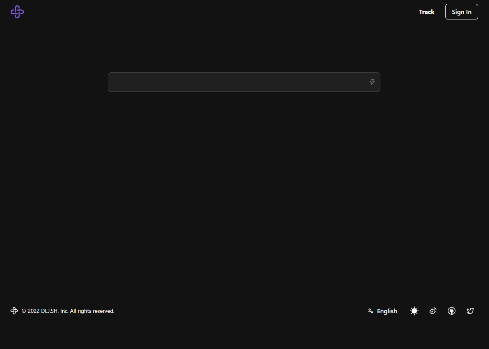
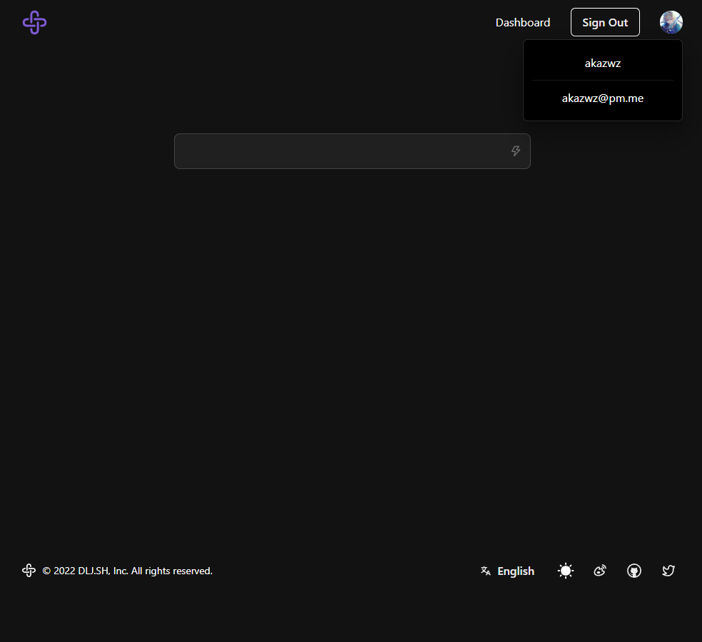
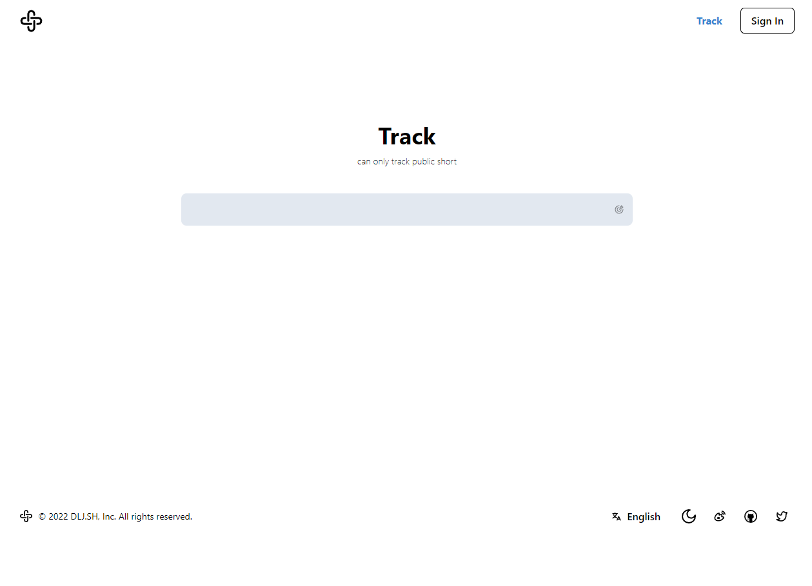
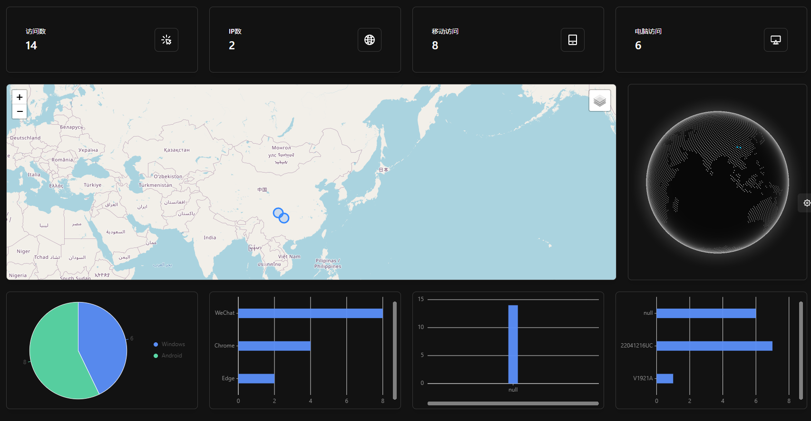

# URL Shorter Next Version

# https://dlj.sh

[简体中文](README_ZH.md)

## Simple url shorter build with Next.js, Postgres, Redis

## Features

- Short url
- Track visit
- Track Dashboard Vision
- responsive UI
- i18n (English and Chinese)
- Dark mode

## ScreenShot

## Track Infos

- time
- ip
- region
- country
- city
- lat lng
- ua string
- browser name
- browser version
- os name
- os version
- cpu
- device model
- device vendor
- engine name
- engin version

## Online demo [url shorter](https://zlz.pw/)

## Technologies or libs I use:

### Core Shorter

- Next.js (full stack framework)
- Vercel (deployment serverless)
- NextAuth (github OAuth)
- Redis (storage kv : short code and long urls)
- Upstash (serverless database redis)
- nanoid (generate short code)
- is-url (judge is valid url)
- chakra-ui (frontend ui lib)
- @icon-park/react (icons)

### Visitor Track

- next.js edge middleware (track visit info)
- postgres (storage link and visitor info)
- prisma (ORM)
- leaflet (map: show visitor location)
- react-leaflet (leaflet wrapper)
- cobe (show globe)
- @ant-design/plots (charts)

