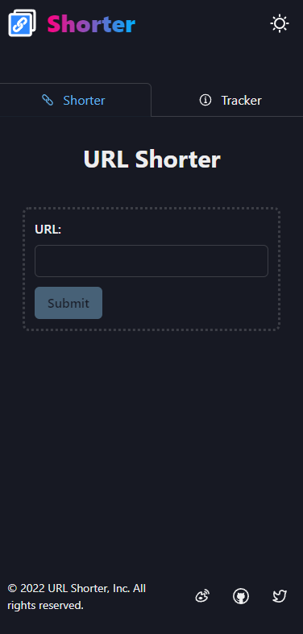
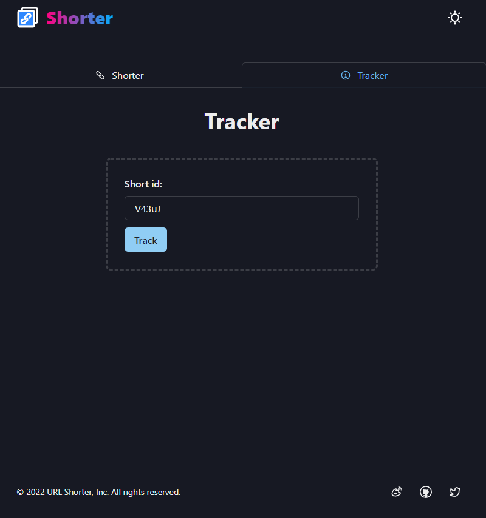
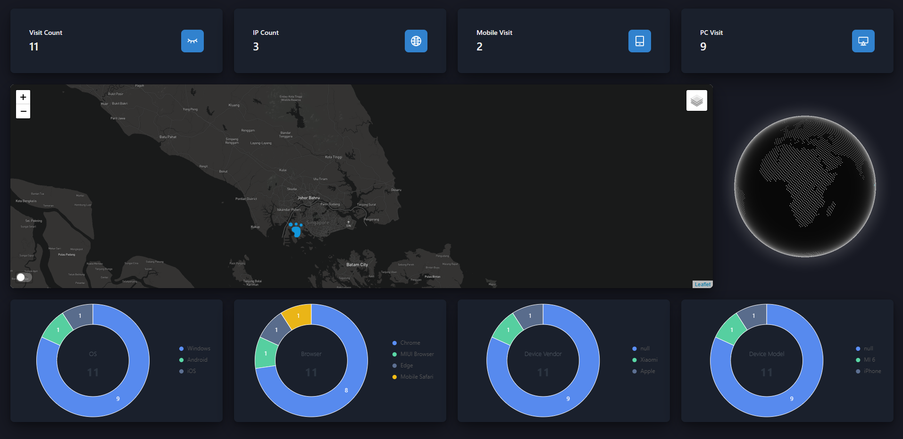
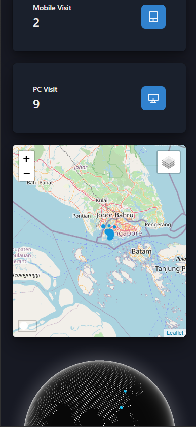

#  ‼️下一个版本和新的域名在 https://dlj.sh

# URL Shorter (下个版本正在开发中， 在 next分支)

[English](README.md)

## 简单的短链生成器 用 next.js 和 redis 构建

## 特点

- 短链生成
- 短链访客追踪
- 短链追踪仪表盘
- 地图和图标可视化
- 响应式的UI

## 项目截图

## 短链访客追踪的信息

- 访问时间

### 地理信息

- ip 地址
- 区域
- 国家
- 城市
- 经纬度坐标

### 浏览器信息

- 浏览器标识
- 浏览器名称
- 浏览器版本
- 操作系统名称
- 操作系统版本
- cpu型号
- 设备型号
- 设备品牌
- 引擎名称
- 引擎版本

## 在线预览 demo [短链生成](https://zlz.pw/)

## 我用的的技术和库:

### 短链生成的核心

- next.js (全栈框架)
- vercel (serverless 部署)
- redis (储存 kv : shortid and 长链接)
- upstash (serverless redis 数据库)
- ioredis (node redis 库)
- nanoid (生成 short id)
- is-url (判断是否为合法的链接)
- chakra-ui (前端UI库)
- @icon-park/react (图标)

### 短链访客追踪

- next.js edge middleware (收集访客信息)
- postgres (储存短链和访客信息)
- prisma (ORM)
- leaflet (地图: 展示访客位置)
- react-leaflet (leaflet wrapper)
- cobe (展示地球-访客位置)
- @ant-design/plots (图表)

